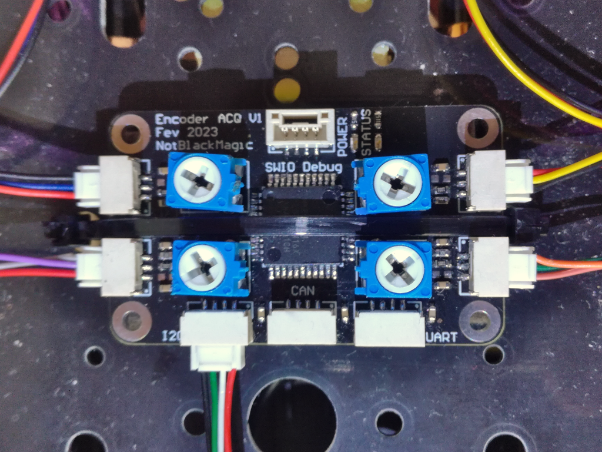

# WheelEncoder
This repository contains the acquisition board hardware and firmware for a Wheel Encoder system developed for the NXP Mobile Robotics Buggy3 Kit, the [MR-Buggy3](https://www.nxp.com/design/designs/mobile-robotics-buggy3-kit-including-rddrone-fmuk66-and-peripherals:MR-BUGGY3). It was initially designed and developed during the NXP [HoverGames3](https://www.hackster.io/contests/nxp-hovergames-challenge-3), as part of my project for this competition: the [AutoSQA](https://www.hackster.io/NotBlackMagic/autonomous-soil-quality-assessment-autosqa-2eb2de). The Wheel Encoder system is composed of an acquisition board, with 4 inputs for HAL sensors (S49e) and multiple interfaces (I2C/UART/CAN), the hardware necessary to mount the HAL sensors to the MR-Buggy3 and the driver for the [PX4 Autopilot](https://px4.io/) to integrate it into this autopilot system, in this case running on the NXP [FMUK66](https://www.nxp.com/design/designs/px4-robotic-drone-vehicle-flight-management-unit-vmu-fmu-rddrone-fmuk66:RDDRONE-FMUK66).

	

More in-depth information and documentation on this Wheel Encoder system can be found on my website: https://notblackmagic.com/projects/wheel-encoder/

Also, a demo video showing how the system works and how it is integrated into the MR-Buggy3 and the PX4 autopilot, can be found on YouTube: https://youtu.be/qfiv8_sycEg

## Folder Structure
This folder contains the firmware code for the Wheel Encoder Acquisition board, developed with the NXP [MCUXpresso IDE](https://www.nxp.com/design/software/development-software/mcuxpresso-integrated-development-environment-ide:MCUXpresso-IDE). The relevant folders/files for this are **"/board, /device, /source, WheelEncoder.mex"**. The remaining folders contain necessary additional files:

**Arduino:** Contains the Arduino code for both the Arduino version of the wheel encoder and a test I2C encoder reader.

**Hardware:** Contains the files for the Wheel Encoder Acquisition board hardware (Gerber + Schematic) and the 3D files (.STL) for the HAL encoder holders for the MR-Buggy3 (WLToys 124019).

## PX4 Firmware
A custom fork of the PX4 firmware, forked from the V1.14 Beta version, contains the driver files for this Wheel Encoder, integrating it into the PX4 autopilot through standard **WheelEncoders.msg** uORB messages. The fork is available on my GitHub:

PX4 fork: https://github.com/NotBlackMagic/PX4-Autopilot/tree/Encoder